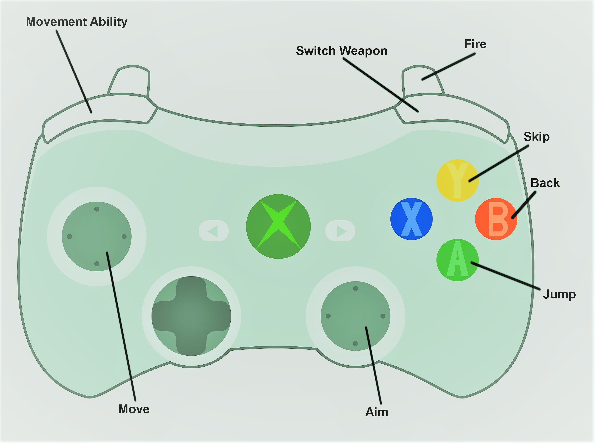

# The Story
The world's first sentient AI has left behind a virtual world, known as The Temple. After many trials, you have managed to access this world, and must fight your way through to unlock whatever secrets The Temple holds.

# Gameplay
Neo Divitias is a two-player platformer-shooter in which players must co-operate in order to advance through various levels. Players gather energy from destroyed enemies and collected objectives, which can be used to purchase powerful equipment from an arsenal of four weapons, two movement abilities and a health upgrade. At the end of the game, players are turned against each other and must face off in a first-to-three duel, gaining points for either capturing the objective zone or killing the other player.

# Controls
Neo Divitias is designed to be played with two Xbox 360 controllers.

# Team
* Michael White     &nbsp;&nbsp;  - WHTMIC023
* Daniel Munday     &nbsp;&nbsp;  - MNDDAN004
* Matthew Morris    &nbsp;        - MRRMAT011
* Adrian Krige      &nbsp;&nbsp;&nbsp;  - KRGADR004
